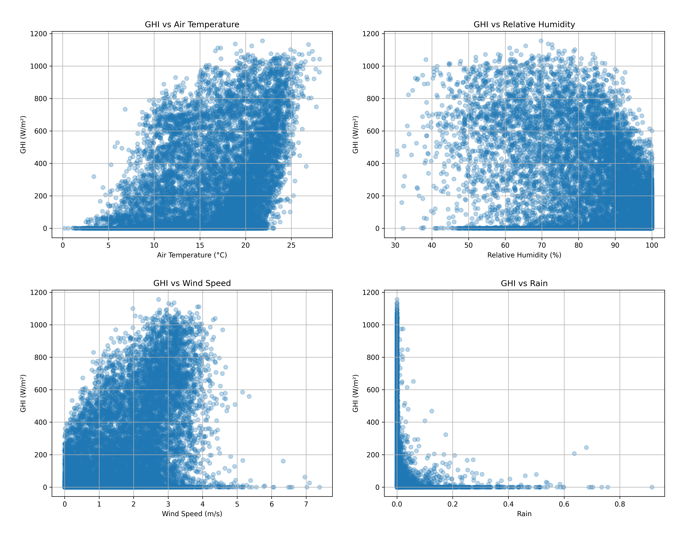
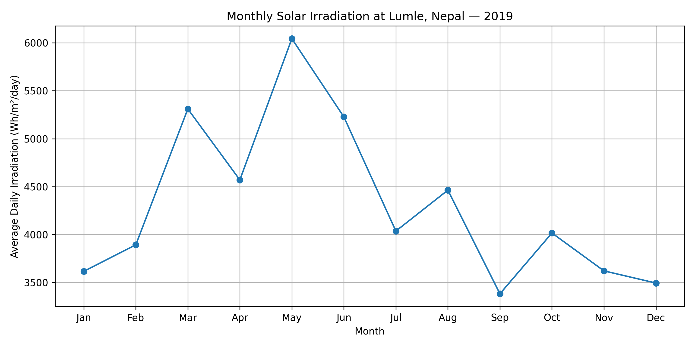
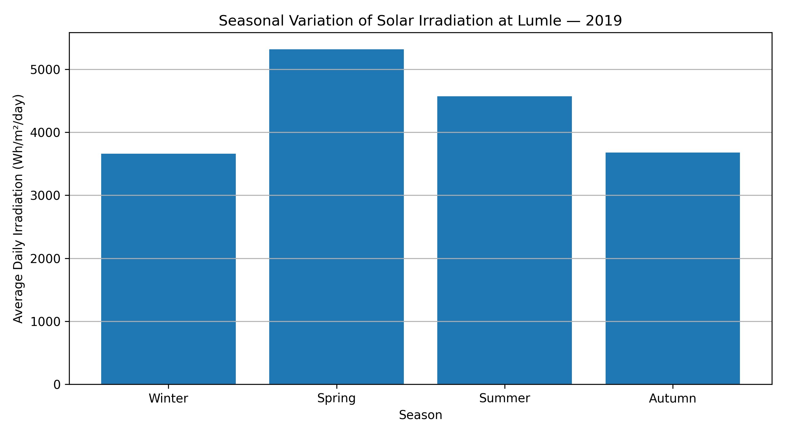
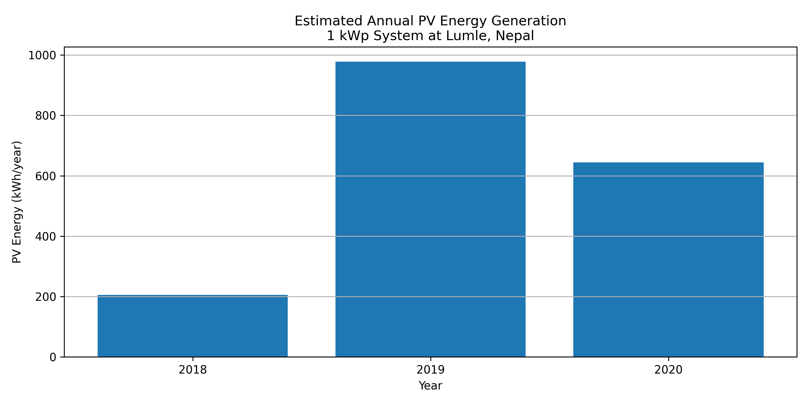
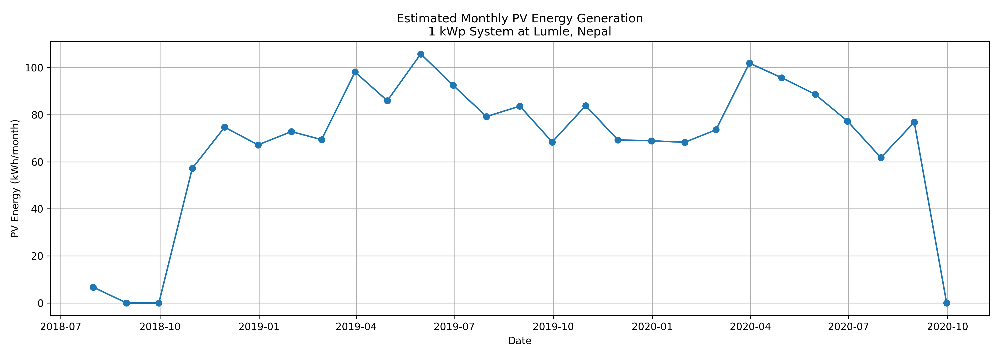
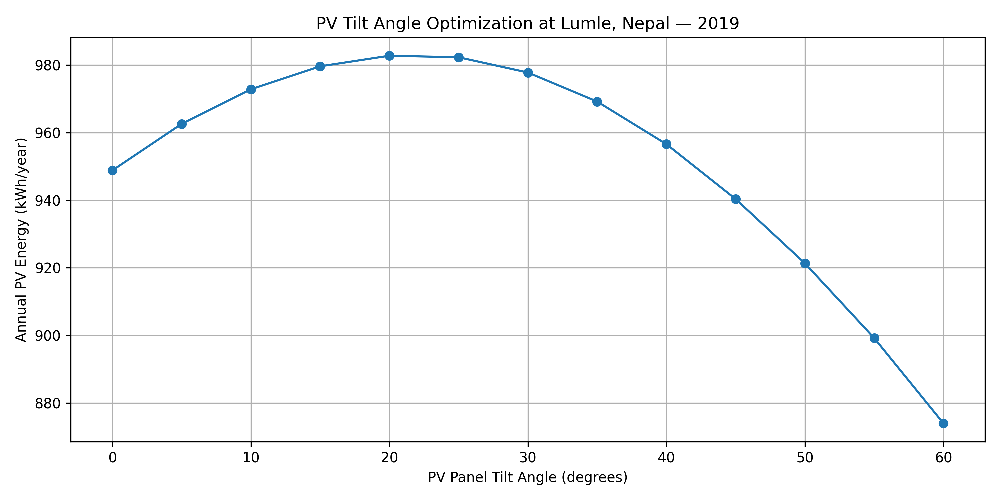

# Solar PV Resource Assessment and Energy Estimation at Lumle, Nepal

## 📌 Project Overview

This project analyzes solar radiation and meteorological data from Lumle, Nepal, and estimates photovoltaic (PV) electricity generation using Python.

The project combines solar resource assessment, meteorological data analysis, correlation analysis, seasonal variation, PV energy estimation, and PV panel tilt-angle optimization.

This is my first personal project in solar PV data analysis and modeling.

---

## 🎯 Objectives

The main objectives of this project are:

- Analyze and understand solar radiation and meteorological data
- Investigate the relationship between GHI and different weather parameters
- Calculate correlations between solar radiation and meteorological variables
- Analyze monthly solar irradiation for the complete year 2019
- Study seasonal variation in solar irradiation
- Estimate PV electricity generation for a 1 kWp PV system
- Determine the optimum PV panel tilt angle for Lumle, Nepal

---

## 📍 Study Location

**Location:** Lumle, Nepal

**Latitude:** 28.2965° N

**Longitude:** 83.8179° E

**Time Zone:** Asia/Kathmandu

---

## 📊 Dataset

The dataset contains minute-level solar radiation and meteorological measurements from Lumle, Nepal.

The main variables used in this project include:

- Global Horizontal Irradiance (GHI)
- Direct Normal Irradiance (DNI)
- Diffuse Horizontal Irradiance (DHI)
- Air Temperature
- Relative Humidity
- Wind Speed
- Rainfall
- Barometric Pressure

### Study Period

**July 2018 – September 2020**

The year **2019** was selected for annual and seasonal analysis because it is the complete calendar year available in the dataset.

---

## 🛠️ Tools and Technologies

This project was developed using:

- **Python**
- **Pandas** – data processing and analysis
- **Matplotlib** – data visualization
- **pvlib** – solar position and photovoltaic system modeling

---

# 🔬 Methodology

## 1. Data Analysis

The dataset was loaded using Pandas and examined to understand:

- Dataset size
- Column names
- Data types
- Missing values
- Basic statistical characteristics
- Solar radiation measurements

The original dataset contains approximately **1.14 million minute-level observations**.

---

## 2. Hourly Data Processing

The original minute-level measurements were converted into hourly averages.

Hourly data were used for relationship analysis and PV energy modeling to reduce the size of the dataset and make the analysis easier to interpret.

---

## 3. Relationship Between GHI and Weather Parameters

Scatter plots were created to investigate the relationships between Global Horizontal Irradiance (GHI) and:

- Air Temperature
- Relative Humidity
- Wind Speed
- Rainfall

These plots were used to visually investigate how different meteorological conditions are associated with solar irradiance.

---

## 4. Correlation Analysis

A correlation matrix was calculated for:

- GHI
- DNI
- DHI
- Air Temperature
- Relative Humidity
- Wind Speed
- Rainfall

The correlation analysis was used to examine the strength and direction of linear relationships between solar radiation and meteorological variables.

---

## 5. Monthly Solar Irradiation Analysis

Daily GHI irradiation was calculated from the minute-level measurements.

The daily values were then used to calculate the average daily solar irradiation for each month of **2019**.

The results were presented as a monthly solar irradiation graph.

---

## 6. Seasonal Variation

The complete year 2019 was divided into four seasons:

| Season | Months |
|---|---|
| Winter | December, January, February |
| Spring | March, April, May |
| Summer | June, July, August |
| Autumn | September, October, November |

The average daily solar irradiation was calculated for each season to investigate seasonal variation in the solar resource at Lumle.

---

# ☀️ PV Energy Estimation

## PV System Assumptions

A preliminary PV energy estimation model was developed using `pvlib`.

The reference system uses:

- **PV system size:** 1 kWp
- **Panel orientation:** South
- **Reference tilt angle:** 30°
- **Performance Ratio (PR):** 0.80
- **Ground albedo:** 0.20

Solar position was calculated using the latitude, longitude and time zone of Lumle.

GHI, DNI and DHI were used to calculate the **Plane-of-Array (POA) irradiance** incident on the PV panel.

The estimated PV energy was then calculated on:

- Daily
- Monthly
- Annual

timescales.

---

# 📐 PV Tilt Angle Optimization

PV panel tilt angles from **0° to 60°** were evaluated at **5° intervals**.

For each tilt angle:

1. Solar position was calculated.
2. POA irradiance was calculated using GHI, DNI and DHI.
3. PV energy generation was estimated.
4. Total annual PV generation for 2019 was calculated.

The tilt angle producing the highest estimated annual PV generation was selected as the optimum tilt angle under the assumptions of this model.

---

# 📈 Key Results

The tilt-angle optimization produced:

### Optimal Tilt Angle

**20°**

### Maximum Estimated Annual PV Generation

**982.72 kWh/year**

### PV System Size

**1 kWp**

The result represents the estimated generation for the Lumle site using the complete **2019 solar dataset** and the assumptions defined in this project.

The optimum tilt angle should therefore be interpreted as the optimum angle **for this dataset and model**, rather than a universal optimum angle for all locations in Nepal.

---

# 📊 Results and Visualizations

## GHI vs Weather Parameters

The project investigates the relationships between GHI and:

- Air Temperature
- Relative Humidity
- Wind Speed
- Rainfall



---

## Monthly Solar Irradiation — 2019

The following graph shows the average daily solar irradiation for each month of 2019 at Lumle.



---

## Seasonal Solar Variation

The seasonal analysis compares average daily solar irradiation during Winter, Spring, Summer and Autumn.



---

## Annual PV Generation

The estimated annual PV generation for the modeled 1 kWp PV system is shown below.



---

## Monthly PV Generation

The estimated monthly PV generation is shown below.



---

## PV Tilt Angle Optimization

The following graph shows the estimated annual PV generation for different PV panel tilt angles.



---

# 📁 Project Structure

```text
solar_pv_data_analysis/
│
├── data/
│   └── solar-measurements_nepal_lumle_wb-esmap_qc.csv
│
├── results/
│   ├── ghi_weather_relationships.png
│   ├── monthly_irradiation_2019.png
│   ├── seasonal_variation.png
│   ├── yearly_pv_generation.png
│   ├── monthly_pv_generation.png
│   └── tilt_optimization.png
│
├── analyze.py
├── README.md
├── requirements.txt
└── .gitignore
```

⚠️Limitations

This project represents a preliminary solar resource assessment and PV energy estimation study.

The current model uses a constant performance ratio of 0.80 and does not separately model all individual PV system losses.

Other limitations include:

Missing values in some DNI and DHI measurements
Simplified PV system loss representation
No detailed temperature-dependent module model
No detailed inverter model
No economic analysis
No battery storage model
Tilt optimization was performed at 5° intervals

Therefore, the estimated PV generation should be considered a preliminary engineering estimate rather than a detailed commercial PV system design.

🚀 Future Improvements

Future development of this project could include:

Temperature-dependent PV module modeling
Detailed inverter modeling
Separate modeling of system losses
Improved treatment of missing DNI and DHI data
Optimization of both tilt and azimuth
Comparison of different PV module technologies
Analysis of different PV system sizes
Sensitivity and uncertainty analysis
Battery energy storage modeling
Techno-economic analysis
Levelized Cost of Energy (LCOE) analysis
Solar power forecasting using machine learning
Comparison of conventional PV modeling with AI-based forecasting

💡Future Research Direction

A possible future extension of this project is to develop a machine-learning-based solar power forecasting model using the available solar and meteorological variables.

Potential inputs could include:

GHI
DNI
DHI
Air Temperature
Relative Humidity
Wind Speed
Rainfall
Time-related features

The predicted solar power could then be compared with conventional PV estimation methods.

👩‍💻 Author

Er. Soniya Karki

Electrical Engineer

Interested in:

Solar PV Systems
Renewable Energy
Battery Energy Storage
Power Systems
Hydrogen Energy
Energy Data Analysis
AI Applications in Renewable Energy

⭐ Acknowledgement

This project uses solar and meteorological measurements from Lumle, Nepal.

The analysis and modeling presented in this repository were developed as an independent learning and engineering project using Python.